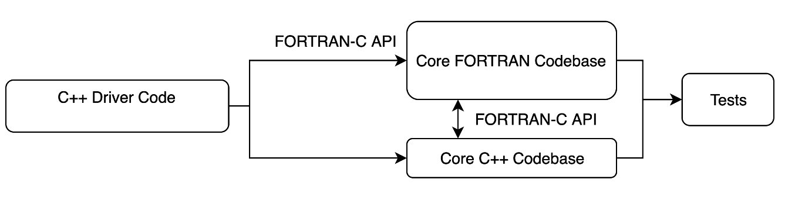
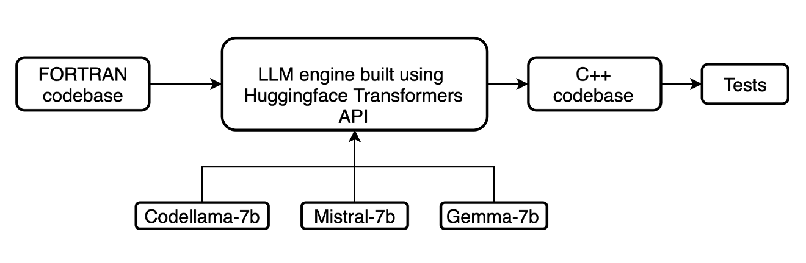

.. |icon| image:: ./media/icon.svg
   :width: 35

####################
 |icon| Code-Scribe
####################

|Code style: black|

**********
 Overview
**********

Code-Scribe is a tool designed to facilitate the incremental translation
of Fortran codebases into C++ using generative AI. It automates the
process of generating corresponding C++ source files and creating
Fortran-C interfaces, simplifying the integration of Fortran and C++.
The tool also allows users to interface with large language models
(LLMs) through the Transformers API, enabling custom prompts tailored to
the specific needs of the source code.

**************
 Key Features
**************

-  Incremental Translation: Translate Fortran codebase into C++
   incrementally, creating Fortran-C layers for seamless
   interoperability.

   |fig1|

-  Custom Prompts: Automatically generate prompts for generative AI to
   assist with the conversion process.

-  Language Model Integration: Leverage LLMs through the Transformers
   API to refine the translation and improve accuracy.

   |fig2|

-  Fortran-C Interfaces: Generate the necessary interface layers between
   Fortran and C++ for easy function and subroutine conversion.

**************
 Installation
**************

At present we recommened installing Code-Scribe in development mode

.. code::

   ./setup develop

Development mode enables testing of features/updates directly from the
source code and is an effective method for debugging. Note that the
``setup`` script relies on ``click``, which can be installed using,

.. code::

   pip install click

The ``code-scribe`` script is installed in ``$HOME/.local/bin``
directory and therfore the environment variable, ``PATH``, should be
updated to include this location for command line use.

*******************
 Statement of Need
*******************

In scientific computing, translating legacy Fortran codebases to C++ is
necessary to leverage modern libraries and ensure performance
portability across various heterogeneous high-performance computing
(HPC) platforms. However, bulk translation of entire codebases often
results in broken functionality and unmanageable complexity. Incremental
translation, which involves creating Fortran-C layers, testing, and
iteratively converting the code, is a more practical approach.
Code-Scribe supports this process by automating the creation of these
interfaces and assisting with generative AI to improve efficiency and
accuracy, ensuring that performance and functionality are maintained
throughout the conversion.

**********
 Citation
**********

.. code::

    @software{akash_dhruv_2024_13845914,
      author       = {Akash Dhruv},
      title        = {{akashdhruv/code-scribe: Initial development
                   release}},
      month        = sep,
      year         = 2024,
      publisher    = {Zenodo},
      version      = {0.dev},
      doi          = {10.5281/zenodo.13845914},
      url          = {https://doi.org/10.5281/zenodo.13845914}
   }

.. |Code style: black| image:: https://img.shields.io/badge/code%20style-black-000000.svg
   :target: https://github.com/psf/black

